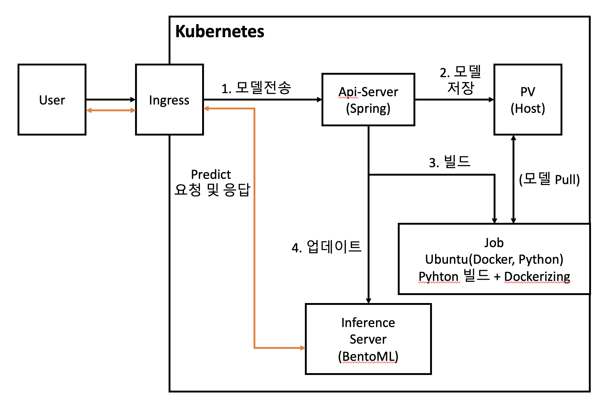

# PoC
<center>시스템 구조</center>


## 기능

### 기능 1. 모델 업데이트<br>

- 유저가 api-server에 모델 파일과 같이 POST API 보냄<br>
- 사전에 인퍼런스 서버 빌드를 위한 환경 이미지를 구성 (우분투에 도커 ce, cli와 파이썬 3.8버전 설치 및 빌드 스크립트 복사) <br>
```javascript
// Dockerfile

FROM ubuntu:20.04

// 1. docker install
WORKDIR /usr/src/builder
ARG DEBIAN_FRONTEND=noninteractive
ENV TZ=Asia/Seoul

RUN apt update -y

RUN apt install -y \
    ca-certificates \
    curl \
    gnupg \
    lsb-release \
    apt-transport-https \
    sudo

RUN mkdir -p /etc/apt/keyrings && \
    curl -fsSL https://download.docker.com/linux/ubuntu/gpg | gpg --dearmor -o /etc/apt/keyrings/docker.gpg

RUN echo \
    "deb [arch=$(dpkg --print-architecture) signed-by=/etc/apt/keyrings/docker.gpg] https://download.docker.com/linux/ubuntu \
    $(lsb_release -cs) stable" | tee /etc/apt/sources.list.d/docker.list > /dev/null

RUN apt update -y

RUN apt install -y \
    docker-ce \
    docker-ce-cli

// 2. python install
RUN apt install -y python3.8 python3-pip &&\
    python3.8 -m pip install --upgrade pip

RUN apt install git

// 3. build script copy
COPY build.sh /apps/build.sh
```
- api-server는 빌드용 이미지를 통해 인퍼런스 서버를 빌드하는 Kubernetes Job을 실행 (호스트 도커 소켓을 마운트하면서 실행)<br>
```YAML
# job.yaml 
apiVersion: batch/v1
kind: Job
metadata:
name: poc-build-job
spec:
template:
    spec:
    containers:
    - name: poc-build-job
        image: poc-build:0.1
        command: ["/bin/sh", "/apps/build.sh"]
        volumeMounts:
        - name: docker-sock
        mountPath: /var/run/docker.sock
        - name: pv-poc-storage
        mountPath: "/models"
    volumes:
    - name: docker-sock
        hostPath:
        path: /var/run/docker.sock
    - name: pv-poc-storage
        persistentVolumeClaim:
        claimName: pv-poc-claim
    restartPolicy: Never
```
- Job은 빌드 이미지를 안에 같이 도커라이징한 스크립트를 통해서 인퍼런스 서버 구성 (깃에서 bentoml 코드와 필요 모듈을 가져와 인퍼런스 서버를 새로 도커라이징)<br>
```sh
# build.sh

# 1. buildfiles pull
while :
do
    if [ ! -d ./So1s-PoC-BuildFiles ];
    then
        echo "git cloning..."
        git clone https://github.com/shinilseop/So1s-PoC-BuildFiles.git
    else
        echo "git cloning is finish."
        break
    fi
    sleep 1
done

# 2. install python module
while :
do
    search=`pip list | grep -i bentoml`
    if [ -z ${search} ];
    then
        echo "python module installing..."
        pip3 install -r ./So1s-PoC-BuildFiles/requirements.txt
    else
        echo "python module install finished!"
        break
    fi
    sleep 1
done

echo "export PROTOCOL_BUFFERS_PYTHON_IMPLEMENTATION=python"
export PROTOCOL_BUFFERS_PYTHON_IMPLEMENTATION=python

# 3.bentoml bundling
while :
do
    if [ ! -d /root/bentoml/repository ]; 
    then
        echo "bentoml bundling..."
        python3.8 ./So1s-PoC-BuildFiles/src/main.py
    else
        echo "bentoml bundle is created."
        break
    fi
    sleep 1
done

# 4. bentoml containerizing
bentoml containerize TransformerService:latest -t poc-infer:0.1
```
- 업로드가 완료되면 새로 업데이트된 인퍼런스 서버 이미지로 교체하는 업데이트 시작

### 기능 2. 모델 인퍼런스

- 쿠버네티스 클러스터 안에 위에서 배포한 인퍼런스 서버가 디플로이먼트로 배포되어있고 인그레스(nginx)와 서비스 구성을 통해 API 요청을 받아들이는 중
- localhost/inference/predict로 {"text":"원하는 데이터"} 와 같이 Json 형태로 POST 요청을 보내면 bentoml의 flask 서버가 요청을 처리해서 predict 결과를 보내줌